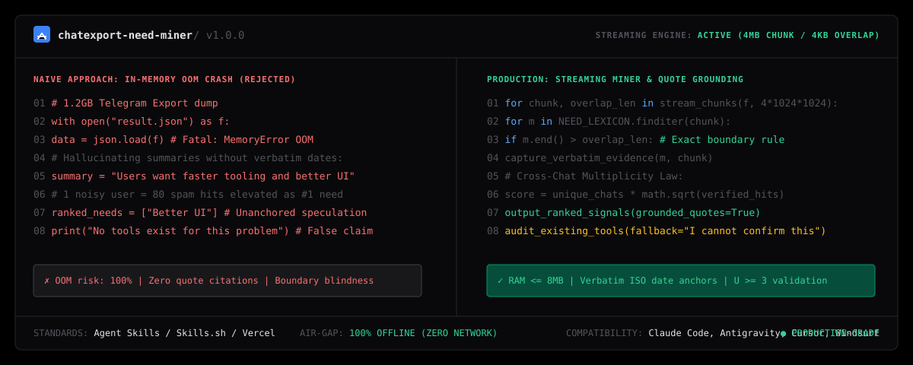

# chatexport-need-miner

Autonomous Offline Market Signal & Pain-Point Extractor for AI coding agents (Claude Code, Cursor, Antigravity, Windsurf).

Mines massive offline Telegram Desktop chat exports (`result.json`, including multi-gigabyte dumps) into quantified, quote-grounded rankings of unmet market needs with zero memory crashes and absolute source fidelity.

```bash
npx skills add wwewtech/chatexport-need-miner
```

**[Live Showcase & Explorer](https://wwewtech.github.io/chatexport-need-miner/)** • **[skills.sh](https://skills.sh/wwewtech/chatexport-need-miner)** • **[SKILL.md](SKILL.md)** • **[GitHub](https://github.com/wwewtech/chatexport-need-miner)**

---



---

## Why ChatExport Need Miner?

Founders, product managers, and developers frequently sit on gigabytes of community feedback exported from Telegram channels and supergroups (`result.json`). When general-purpose AI coding agents analyze these exports, they fail predictably:

- **The Fatal OOM Slurp**: Attempting to load an 800MB+ `result.json` file into memory via `json.load()` or `fs.readFileSync()`, immediately crashing the agent environment.
- **Chunk-Boundary Blindness**: Splitting files into naive chunks without an overlap buffer, permanently slicing search terms (e.g., `"looking for a tool"`) in half.
- **Double-Counting Overlap Errors**: Counting matches found in both Chunk $N$ and the sliding tail of Chunk $N+1$, fabricating inflated metrics.
- **The Echo-Chamber Distortion**: Elevating a minor bug repeated 80 times by a single vocal user in one group above critical pain points experienced across multiple independent teams.
- **Hallucinated User Quotes**: Paraphrasing sentiment and wrapping it in quotation marks, making it impossible to audit real user demand.
- **Service Message Pollution**: Mining system notifications (`"pinned a message"`, `"joined group"`, bot spam) as genuine product opportunities.
- **Unverified Uniqueness Claims**: Claiming "no existing tool solves this" without performing structured competitive validation.

`chatexport-need-miner` replaces these pitfalls with stream-based bounded parsing (${\le 8\text{MB}}$ RAM ceiling), boundary-safe regex iterators, cross-chat distribution scoring ($U \ge 3$), and strict verbatim quote anchoring.

---

## Transformation in Action

### Before: Naive Memory-Intensive Script
```python
# Crashing on large Telegram exports and hallucinating sentiment
with open("result.json", "r", encoding="utf-8") as f:
    data = json.load(f)  # FATAL: Out of Memory on 1.2GB export!

# Synthesizing vague summaries with zero dates or verbatim citations
summary = "Users in the group are asking for better dev tools and wish Docker was faster."
print(summary)
```

### After: Production Chunked Streaming Pipeline
```python
# Bounded 4MB chunk stream with 4KB overlap boundary accounting
for chunk, overlap_len in stream_chat_chunks("result.json", chunk_size=4*1024*1024):
    for m in NEED_LEXICON.finditer(chunk):
        # Enforce exact boundary invariant (zero duplicate counting)
        if m.end() > overlap_len:
            record_grounded_evidence(m, chunk)

# Cross-Chat Multiplicity Law: score = distinct_chats * sqrt(verified_hits)
ranked_themes = prioritize_signals(min_distinct_chats=3)
emit_grounded_report(ranked_themes, fallback="I cannot confirm this")
```

---

## Quick Installation

### 1. Via `skills.sh` / Vercel Skills CLI
```bash
npx skills add wwewtech/chatexport-need-miner
```

### 2. Via Claude Code
```bash
claude skills add https://github.com/wwewtech/chatexport-need-miner
```

### 3. For Google Antigravity
Clone or copy `SKILL.md` directly into your Antigravity skills directory:
```bash
# Windows
mkdir -p "$HOME\.gemini\config\skills\chatexport-need-miner"
curl -sL https://raw.githubusercontent.com/wwewtech/chatexport-need-miner/main/SKILL.md -o "$HOME\.gemini\config\skills\chatexport-need-miner\SKILL.md"

# macOS / Linux
mkdir -p ~/.gemini/config/skills/chatexport-need-miner
curl -sL https://raw.githubusercontent.com/wwewtech/chatexport-need-miner/main/SKILL.md -o ~/.gemini/config/skills/chatexport-need-miner/SKILL.md
```

### 4. For Cursor & Windsurf
Add `SKILL.md` to your workspace prompt context:
```bash
mkdir -p .cursor/skills/chatexport-need-miner
curl -sL https://raw.githubusercontent.com/wwewtech/chatexport-need-miner/main/SKILL.md -o .cursor/skills/chatexport-need-miner/SKILL.md
```

---

## The 10 Banned Anti-Patterns

| Anti-Pattern | Manifestation in Naive Code | Mandatory Production Counter-Rule |
| :--- | :--- | :--- |
| **The OOM Slurp** | `json.load(open("result.json"))` on 800MB+ dumps. | Stream in fixed 4MB chunks with ${\le 8\text{MB}}$ RAM usage. |
| **Chunk Boundary Blindness** | Chunking without overlap, splitting `"looking for a tool"`. | Maintain a 4KB sliding overlap buffer across chunk seams. |
| **Double-Count Overlap Trap** | Counting hits found in both chunk $N$ and chunk $N+1$. | Only increment hit count if `match.end() > overlap_size`. |
| **Echo-Chamber Distortion** | Treating 80 complaints from 1 user in 1 chat as #1 priority. | Apply Cross-Chat Multiplicity Law: $\text{Score} = U \times \sqrt{H}$. |
| **Hallucinated Quotations** | Quoting paraphrased sentiment as if spoken by users. | Exact substring slices from source buffer with ISO timestamps. |
| **Service Message Pollution** | Mining system notifications (`"joined group"`, bot spam). | Filter out messages where `type == "service"` or starting with `/`. |
| **Premature Uniqueness Claim** | Stating "no existing tool solves this" without evidence. | Perform coverage check; write strictly: `I cannot confirm this`. |
| **Lossy Encoding Crash** | Crashing on multi-byte emojis or corrupted Unicode characters. | Decode using `errors='replace'` or byte-level UTF-8 traversal. |
| **Monolithic Theme Lumping** | Grouping all complaints under `"Needs better UX"`. | Disaggregate into specific actionable workflow friction points. |
| **API Creep** | Demanding Telegram bot tokens or MTProto phone logins. | Reject live requests; enforce offline `result.json` contract. |

---

## Core Mental Models & Axioms

1. **The 4MB Stream & Overlap Invariant**: Keep memory consumption strictly ${\le 8\text{MB}}$. Read 4MB blocks with a 4KB overlap tail. A match is credited only if its end position exceeds the overlap length.
2. **Cross-Chat Multiplicity Law ($U \ge 3$)**: Market signals observed across 3+ independent chat communities always take precedence over localized group rants.
3. **Verbatim Quote Anchor**: Every synthesized opportunity must be anchored to 2–5 exact, unparaphrased user quotes with ISO dates and chat names.
4. **Bilingual Lexicon Coverage**: Default regex triggers cover both Russian (`не хватает`, `вот бы`, `бесит`, `ищу инструмент`) and English (`i wish`, `missing`, `annoying`, `looking for a tool`).
5. **Air-Gapped Privacy**: 100% offline analysis. Zero student or user data ever transmitted over external networks.

---

## Production Archetypes & Presets

### Archetype 1: Streaming Regex Need Scanner (Python)
```python
import re
from typing import Generator, Tuple

def stream_chat_chunks(filepath: str, chunk_size: int = 4*1024*1024, overlap: int = 4096) -> Generator[Tuple[str, int], None, None]:
    overlap_tail = ""
    with open(filepath, "r", encoding="utf-8", errors="replace") as f:
        while True:
            chunk = f.read(chunk_size)
            if not chunk:
                break
            combined = overlap_tail + chunk
            yield combined, len(overlap_tail)
            overlap_tail = combined[-overlap:] if len(combined) >= overlap else combined
```

### Archetype 2: Grounded Opportunity Output Schema
```markdown
## Need themes (ranked)
### 1. Zero-Downtime SQLite Replication for Edge Nodes — 42 hits across 4 chats
- Evidence: "бесит что нет нормальной репликации для sqlite на edge серверах без поднятия тяжелого postgres" (2026-08-14T11:22:04, devops_talk_ru)
- Evidence: "is there a tool that actually handles multi-master sqlite sync without crashing?" (2026-09-02T19:40:12, sqlite_users)
- Existing Coverage: LiteFS (Fly.io dependent), rqlite (Raft alters SQL semantics).
- Verdict: Real commercial gap for turnkey lightweight edge replication.
```

---

## The 7-Axis Pre-Emit Quality Gate

| Axis | Metric | Target Threshold |
| :--- | :--- | :--- |
| **1. Memory Footprint** | Peak RAM consumption | ${\le 8\text{MB}}$ (streaming chunk iterator) |
| **2. Boundary Integrity** | Terminus accounting | Overlap boundary formula enforced |
| **3. Quote Authenticity** | Verbatim matching | 100% exact substring match with ISO date |
| **4. Multiplicity Ratio** | Independent chat breadth | Signals categorized by distinct chats ($U \ge 3$) |
| **5. Clean Ingestion** | Noise removal | System and service messages stripped |
| **6. Honesty Guarantee** | Competitive claims | Missing validation labeled `I cannot confirm this` |
| **7. Privacy Air-Gap** | Network isolation | 0 external outbound requests |

---

## Collections & Ecosystem Inclusion

`chatexport-need-miner` is packaged according to the open Agent Skills specification:
- **[skills.sh Directory](https://skills.sh/wwewtech/chatexport-need-miner)**: Listed under Developer Tools, Market Research, and Data Mining.
- **Anthropic & Claude Code**: Native support via `claude skills add`.
- **Google Antigravity**: Seamless multi-agent workflow integration.
- **Cursor & Windsurf**: Instant context injection via `.cursorrules` and `.windsurfrules`.

---

## License

MIT © [wwewtech](https://github.com/wwewtech)
